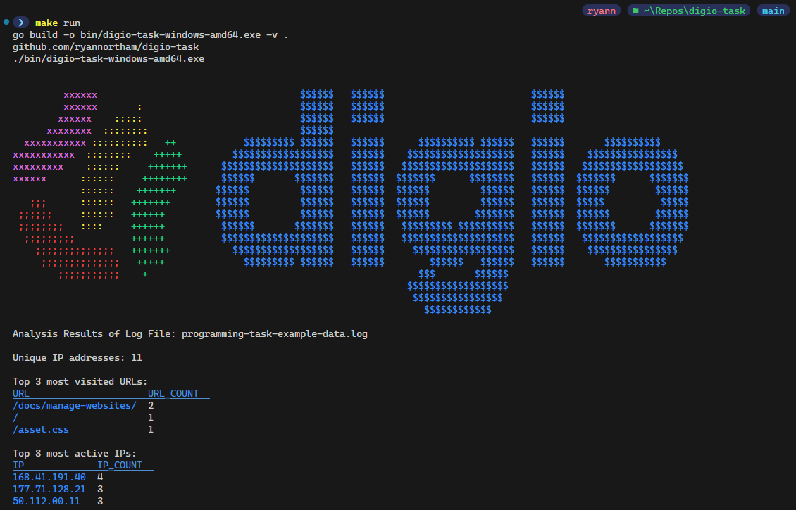

# Digio Programming Task

## Task Instructions

### Overview

The goal of the assignment is to create a solution we can use to have a conversation about software
development using code that you are familiar and comfortable with.

This is not a test of how fast you can solve a problem. We want to see a solution that best represents you and what you’re capable of. We’re not looking for an elaborate solution, but we would like to see something that is clean and well reasoned. This is not a final exam submission, this is the start of a conversation. We care as much about your thought process as the code itself, so capture your assumptions and be prepared to discuss them with us.

We’re looking for readable code, passing tests, and a README that includes instructions and assumptions.

### Time and effort

You may take as long as you wish to complete this assignment. However, we also wish to be respectful
of your time. As an approximate guide we suggest it should take in the order of 2-4 hours.
If you find yourself spending more time you may want to revisit your approach or ask for clarification.

### The task

The task is to parse a log file containing HTTP requests and to report on its contents.

For a given log file we want to know:
- The number of unique IP addresses
- The top 3 most visited URLs
- The top 3 most active IP addresses

### Example Data

`177.71.128.21 - - [10/Jul/2018:22:21:28 +0200] "GET /intranet-analytics/ HTTP/1.1" 200 3574`

A [log file with test data](assets/logs/programming-task-example-data.log) is included with this assignment.

### Deliverables

- For this task you can choose from Java, Python, JavaScript, Kotlin, Go, or C#.
- There are no restrictions on language features and you are free to use third-party libraries.
- Please include tests that demonstrate your solution is working.
- You can submit your solution as a zip file containing the source code or a public git repository.

## Approach

### Assumptions

- The provided logs are in [combined log format.](https://httpd.apache.org/docs/2.2/logs.html#combined)
- Any log data positioned after the user agent field is irrelevant, and can be discarded.
- Log data is trusted to be in a valid format. Log fields require minimal validation during run time.
- The solution should be designed to be extensible, in order to handle additional scenarios beyond the initial given requirements.
- Max three 'top' results will be displayed, regardless of tied results. Solution can be extended later to handle this scenario when business rules are defined.
- We're not dealing with 'big data' here:
    - The log file is small enough to be completely stored in memory.
    - Processing in a single thread is sufficient for the performance requirements.
- Concurrency/containerization is out of scope.
- Log streaming/pagination is out of scope.
- CI/CD is out of scope.

### Goals

- [x] Make a configurable CLI based application using Golang's [Cobra](https://github.com/spf13/cobra) package
- [x] Handle by configuration management using the [Viper](https://github.com/spf13/viper) package.
- [x] Create a [Makefile](https://www.gnu.org/software/make/manual/make.html) to assist with common development tasks.
- [x] Handle data analytics with data frames using the [Gota](https://github.com/go-gota/gota) package
- [x] Create a log reader interface. Enable easy switching from file based logs, to api/database/other based logs at a later date if required.
- [x] Create a log parsing interface. Enable easy switching for different log formats if required.
- [x] Make data analysis functions work for any column in the log data. 
- [x] Make it easy to add additional analytics functions as required.
- [x] The solution should handle malformed log data gracefully.
- [x] Use table tests and [Testify](https://github.com/stretchr/testify) package for unit testing.
- [x] Achieve 90% unit test coverage.

## Building and Running the Program

To build and run the program, follow these steps:

1. Install the Go programming language if you haven't already.
1. Clone the repository to your local machine.
1. Navigate to the root directory of the project.
1. Run the command `make run` to build and execute the program.

The program will read the log file located at `assets/logs/programming-task-example-data.log` and output the desired statistics to the console:

